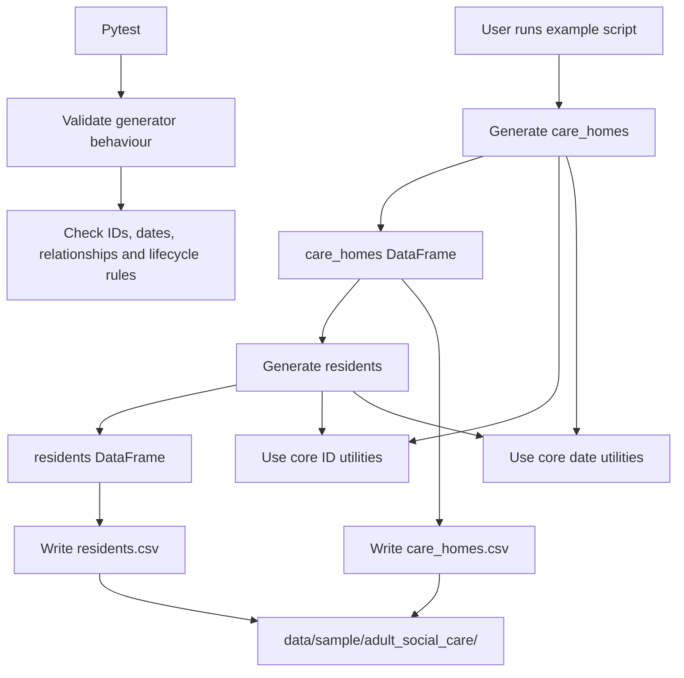

# Adult Social Care Data Flow Diagram

This diagram shows the current Adult Social Care sample generation flow.

The `care_homes` table is generated first. The `residents` table is then generated from the care homes output so that resident records can link to valid care homes and match active occupancy counts.



## Current Output Files

```text
data/sample/adult_social_care/care_homes.csv
data/sample/adult_social_care/residents.csv
```

## Notes

The residents generator depends on the care homes output.

This dependency ensures:

- every resident links to a valid care home
- active resident counts match `care_homes.current_residents`
- historical resident volume can be influenced by `turnover_profile`
- future care-needs, incidents and observations can be linked to valid resident stay periods