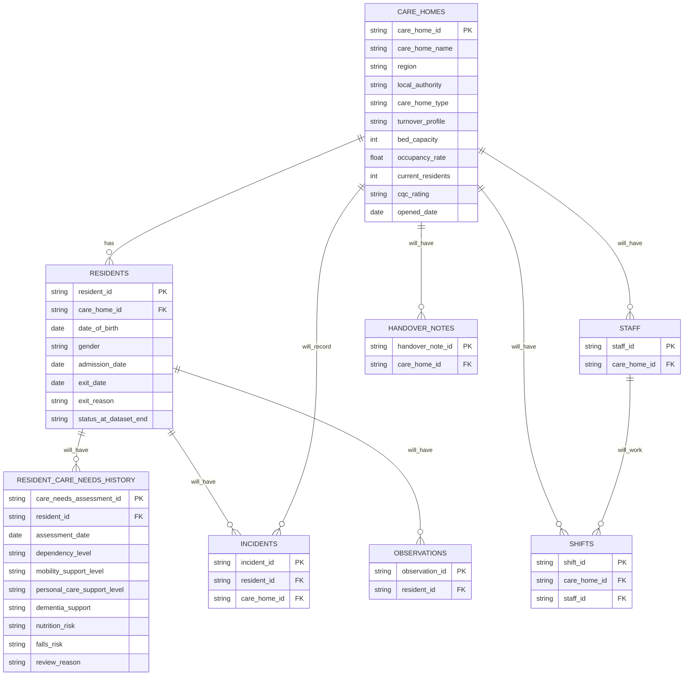

# Adult Social Care Table Relationship Diagram

This diagram shows the current and planned table relationships for the Adult Social Care domain module.

## Implemented Tables

- `care_homes`
- `residents`

## Planned Tables

- `resident_care_needs_history`
- `staff`
- `shifts`
- `incidents`
- `observations`
- `handover_notes`

## Notes

Only `care_homes` and `residents` are currently implemented.

Planned tables are shown to explain the intended direction of the Adult Social Care module. They should not be described as implemented until the relevant generators, tests, documentation and sample outputs exist.