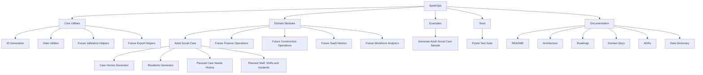

# High-Level Architecture Diagram

This diagram shows the current high-level architecture of SynthOps.

SynthOps separates reusable core utilities from domain-specific generation logic. Adult Social Care is the first implemented domain module, while future domains can reuse the same core utilities.

## Notes

The core package should remain domain-neutral.

Domain-specific logic should live inside `src/synthops/domains/`.

Adult Social Care is the first implemented domain, not the entire product.